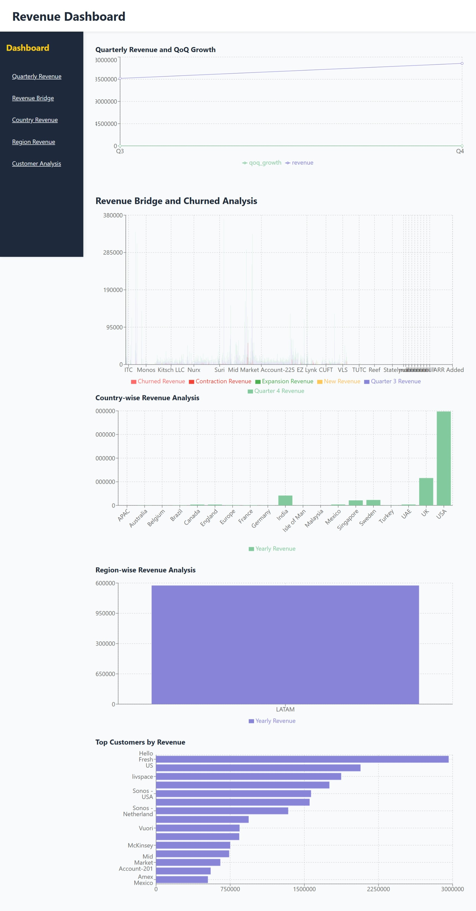

#  Revenue Analysis Dashboard (MERN Stack)

A full-stack web dashboard that visualizes key revenue metrics using interactive charts and tables. Built with **MongoDB**, **Express.js**, **React**, and **Node.js** (MERN stack).

**Hosted-**[Revenue Dashboard]()

---

##  Features

-  Interactive charts (Pie, Bar, Line) using **Recharts**
-  RESTful API built with **Express.js**
-  JSON data dynamically loaded from **MongoDB**
-  Clean and modular code structure
-  Fully responsive **React** UI
-  Dashboard-style layout inspired by design mockups
-  Scrollable sidebar with smooth scrolling to sections

---

##  Tech Stack

**Frontend:**
- React.js
- Recharts
- CSS 

**Backend:**
- Node.js
- Express.js
- MongoDB (via Mongoose)

**Tools:**
- Git & GitHub
- VS Code
- MongoDB Atlas
